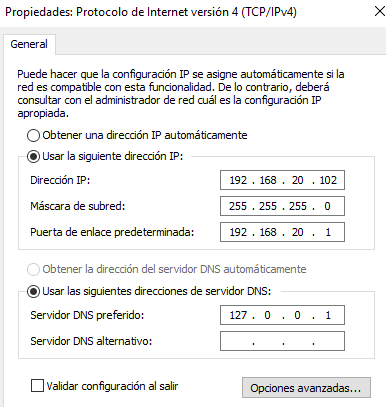
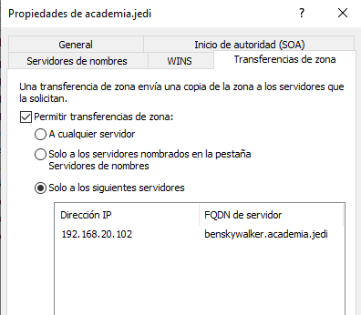
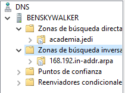
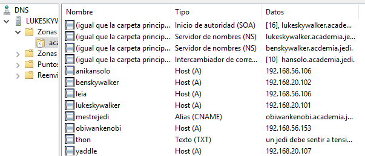
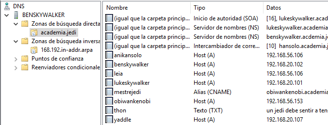
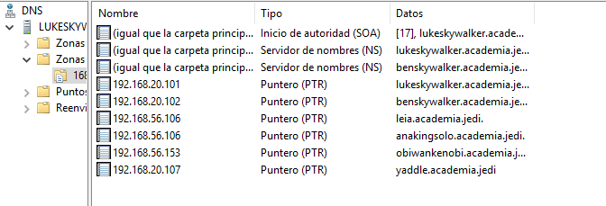
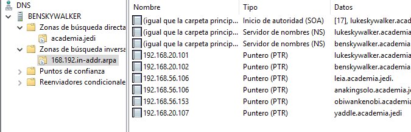

## Tarefa 1.4 Instalación de zonas secundarias con Windows Server.

1. Tomaremos a máquina benskywalker, e configuraremola para ser servidor secundario, tanto da zona primaria academia.jedi de resolución directa como de resolución inversa. Captura a configuración en ambalas dúas máquinas.

    - Configuración TCP/IP do servidor benskywalker

        

    - Indicamos, no equipo lukeskywalker, nas zonas, que se van a poder transferir ó outro servidor (benskywalker)

        

    - Comprobamos a transferencia das zonas no servidor benskywalker

        
    
2. Engade un rexistro tipo A (yaddle 192.168.20.107) na zona de resolución directa e tamén na de resolución inversa. Adxunta captura dos rexistros da zona unha vez feita a transferencia.

    - Engadimos rexistor tipo A yaddle na zona directa:

        - Lukeskywalker:

            
        
        - Benskywalker:

            
    
    - Engadimos rexistro PTR yaddle na zona inversa:

        - Lukeskywalker:

            

        - Benskywalker.

            
    